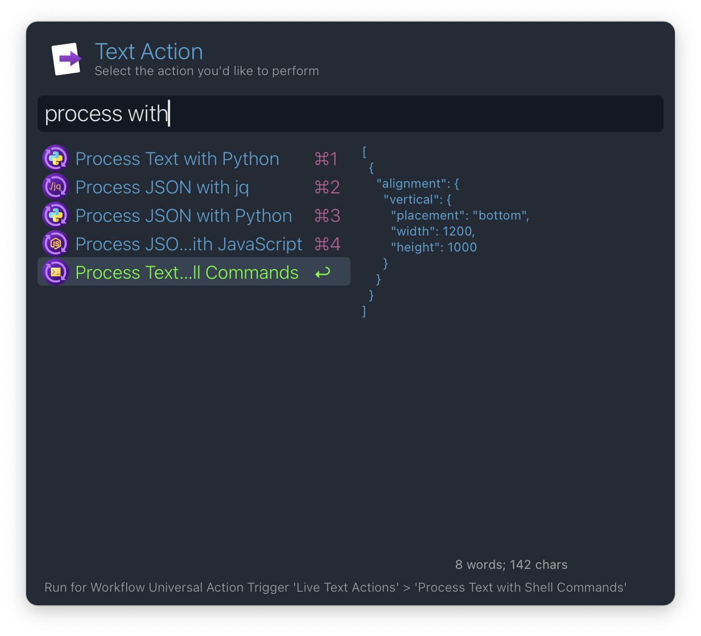
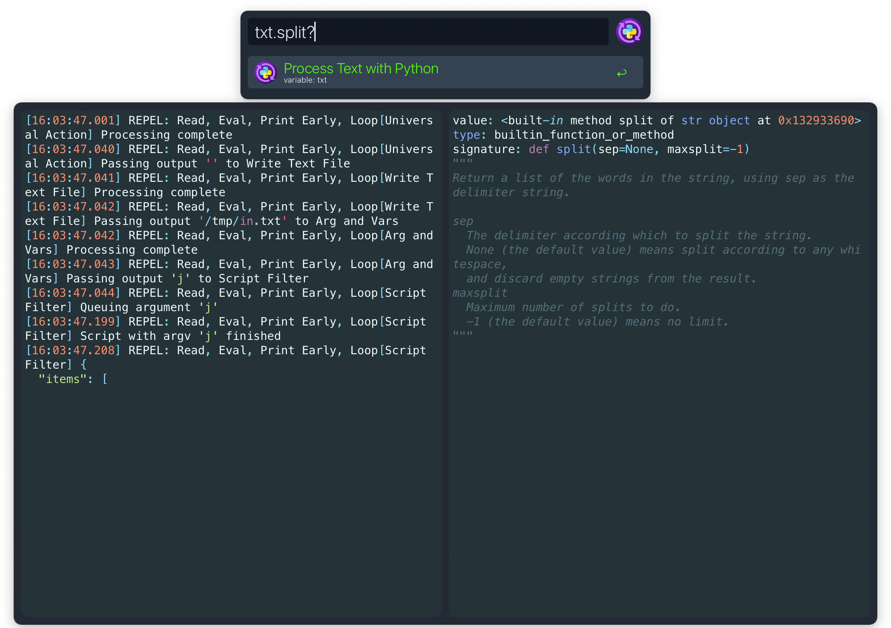
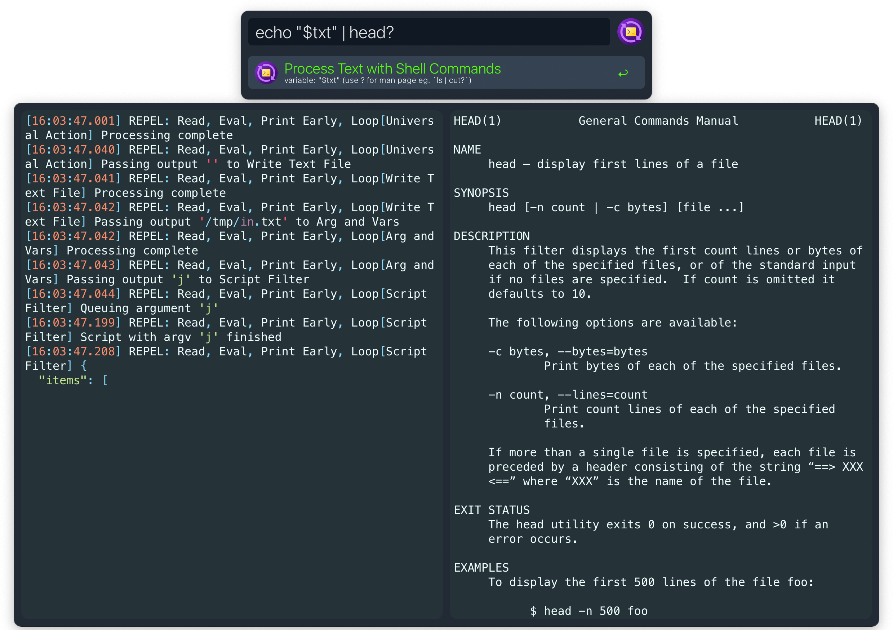

<h1 align="center">
  <br/>
  Live Text Actions for Alfred
</h1>

[Alfred](https://alfredapp.com) workflow for processing / transforming text
as-you-type.

## Installation

Run the following command in terminal:

```shell
curl -sL https://raw.githubusercontent.com/mr-pennyworth/alfred-live-text-actions/main/install.sh | sh
```

## Text Actions

- Process Text with
    - Python
    - Shell Commands
- Process JSON with
    - Python
    - JavaScript
    - jq



## Live Preview

Each text action, once triggered, shows a two-pane UI where the left pane
shows the input text and the right pane shows the output text. The output
text is updated as you type in Alfred.

https://github.com/user-attachments/assets/bbcea2ed-37ce-4fe1-b44c-c1179bf76c14

## Live Docs

The Python and Shell commands support live documentation. Just type `?` after
the command to see the documentation.

### Python Docs



### Shell Command Docs



